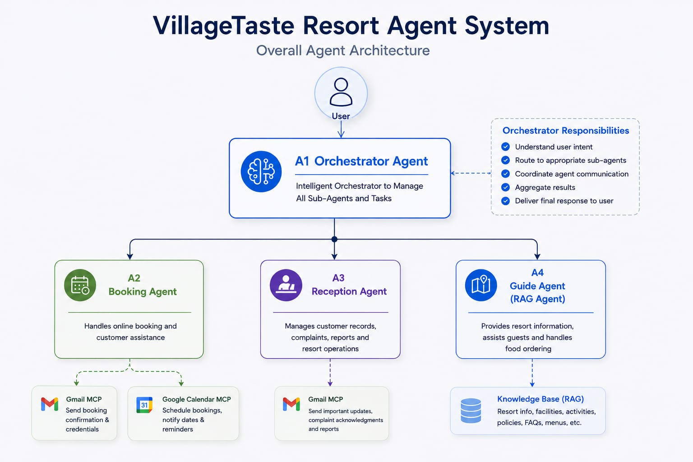
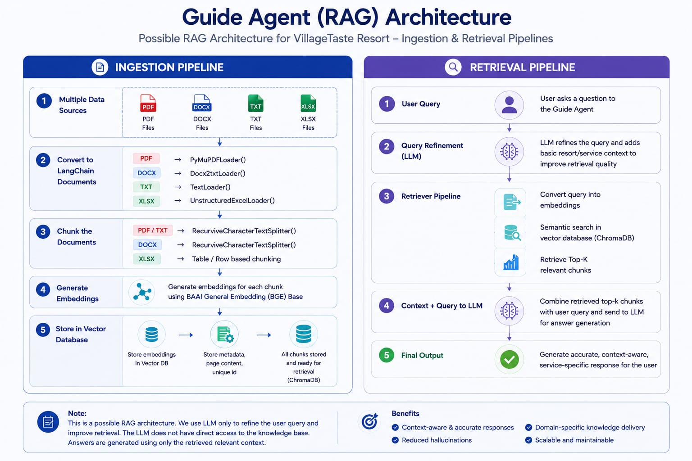

# VillageTaste Resort Multi-Agent System

An eco-luxury, village-themed multi-agent guest assistant system designed for **VillageTaste Resort**. Built using the principles of Google's **Agent Development Kit (ADK) 2.0** and the **Model Context Protocol (MCP)**, this prototype coordinates specialized agents to handle guest bookings, front-desk services, and local FAQ guides statefully and offline-first.

---

## 1. Project Overview

### The Business Problem
VillageTaste Resort offers guests a rustic, mindful retreat focusing on traditional experiences (e.g., pottery workshops, organic farming, village tours) combined with luxury accommodations. However, delivering a high-touch, premium guest experience offline and online presents operational challenges:
*   **Booking Friction**: Coordinating availability, reservations, and notifications without double-bookings.
*   **Operational Tracking**: Logging service requests, complaints, and check-in/out statuses in a shared registry.
*   **Information Dissemination**: Answering complex inquiries about schedules, menus, policies, and activities consistently and accurately.

Traditional single-agent solutions are prone to context dilution, instruction-following failures, and rate limit exhaustions when attempting to manage all these tasks concurrently.

### Why a Multi-Agent Architecture?
A multi-agent design solves these issues through **separation of concerns** and **task specialization**:
1.  **Modularity**: Each agent manages a single domain (RAG-based guide services, transaction-heavy bookings, or dynamic reception tickets).
2.  **Robust Safety**: Rules (such as validation skills and scope guards) are bounded to specific agents, preventing transactional failures.
3.  **Efficiency**: Heavy LLM calls are limited only to cognitive tasks (like natural language synthesis), while deterministic routing and database interactions run locally and efficiently.
4.  **Resilience**: The system supports a dual-mode workflow (Grounded/Online via Gemini vs. Simulation/Offline via local algorithms) so the front desk remains operational even during network outages.

## Capstone Concepts Demonstrated

This project applies multiple concepts from Google's AI Agents: Intensive Vibe Coding Course and demonstrates how modern AI agent systems can support hospitality operations through specialized agent collaboration.

| Course Concept | Implementation |
|----------------|---------------|
| Multi-Agent System (ADK) | Orchestrator Agent, Booking Agent, Reception Agent, and Guide Agent |
| MCP (Model Context Protocol) | Local Google Calendar MCP and Gmail MCP integrations |
| RAG (Retrieval-Augmented Generation) | ChromaDB + BGE Embeddings + Local Knowledge Base |
| Agent Skills | Booking Validator, Complaint Classifier, FAQ Router, Booking Summary Generator |
| Security Features | Input validation, scope guards, restricted routing, controlled state updates |
| Shared State | Persistent guest records and reservation management |
| Antigravity | Project structure and agent workflows generated and refined using Antigravity |

---

## 2. Architecture Overview

The system utilizes a main controller to classify guest intent and coordinate actions across four specialized agents:



### Agent Responsibilities
*   **Orchestrator Agent ([orchestrator.py](file:///d:/Google_Agent_Course/village-taste-agent/agents/orchestrator.py))**: Evaluates raw guest inputs and routes queries to `BOOKING`, `RECEPTION`, `GUIDE`, or `OUT_OF_SCOPE` using Gemini or local semantic keyword triggers.
*   **Booking Agent ([booking.py](file:///d:/Google_Agent_Course/village-taste-agent/agents/booking.py))**: Extracts stay parameters, runs the booking validation skill, statefully checks/reserves calendar blocks, and writes the resulting reservation to the shared guest registry.
*   **Reception Agent ([reception.py](file:///d:/Google_Agent_Course/village-taste-agent/agents/reception.py))**: Identifies guests by email, categorizes front-desk requests (Complaints, Maintenance, Room Service, Check-In, Check-Out), registers service tickets, dispatches repairs, and emails checkout billing folios.
*   **Guide Agent ([guide.py](file:///d:/Google_Agent_Course/village-taste-agent/agents/guide.py))**: Enforces an out-of-scope guard, searches the local vector store, builds retrieved context, and leverages Gemini (or local templates) to answer questions with precise file citations.

---

## 3. RAG Pipeline

The Guide Agent answers resort-related questions through a localized Retrieval-Augmented Generation (RAG) pipeline. Resort knowledge is stored as structured markdown documents, converted into vector embeddings using BAAI/bge-base-en-v1.5, indexed in ChromaDB, and retrieved during guest interactions. Retrieved context is then supplied to the Guide Agent to generate grounded and source-aware responses.



1.  **knowledge_base/**: Contains markdown documents describing activities, food menus, FAQs, resort rules, and history.
2.  **ingest.py**: Crawls the directory, splits text via `RecursiveCharacterTextSplitter` (`chunk_size=500`, `chunk_overlap=50`), and indexes document sources as metadata.
3.  **Embeddings**: Generates vectors using the CPU-friendly, local `BAAI/bge-base-en-v1.5` Hugging Face model.
4.  **ChromaDB**: Persists the vectorized indices in the local `vector_store/` directory.
5.  **retriever.py**: Performs cosine similarity checks against the query. Distance scores ($L2$) above `0.85` are filtered out to prevent irrelevant results.
6.  **Guide Agent**: Combines context chunks with the query, runs a single-call Gemini generation (or local fallback), and appends source attribution citations.

---

## 4. MCP Integration

Model Context Protocol (MCP) integrations are simulated locally within the `mcp/` package to support fully offline development and eliminate external API rate limiting, credentials, or latency during prototyping:

### Google Calendar MCP (`mcp/calendar_mcp.py`)
*   `check_availability(room_type, checkin, checkout)`: Examines current state to verify that the requested room type does not have overlapping bookings during those dates.
*   `reserve_booking_dates(room_type, checkin, checkout, guest_name)`: Blocks dates for the specified room, creates a reservation entry, and returns a unique mock event ID (e.g. `evt_cal_deluxe_villa_1`).
*   `view_reservation(event_id)`: Retrieves booking details.
*   `cancel_reservation(event_id)`: Deletes dates and releases room inventory.

### Gmail MCP (`mcp/gmail_mcp.py`)
*   `send_booking_confirmation(recipient, details)`: Logs booking itineraries and confirmation emails.
*   `send_guest_notification(recipient, message)`: Logs generic check-in or service updates.
*   `send_complaint_acknowledgement(recipient, details)`: Confirms complaint registration and dispatch.
*   `send_checkout_summary(recipient, billing_details)`: Formats and logs the final guest billing folio invoice upon checkout.

---

## 5. Security Features

Security and reliability were important design considerations throughout the project.

Implemented safeguards include:

- Booking validation before reservation creation
- Date format verification and logical date checks
- Guest count validation
- Restricted room type validation
- Guide Agent scope guard for out-of-domain requests
- Controlled state modifications through dedicated modules
- No API keys stored inside source code
- Local MCP simulation to avoid exposing external credentials during development
- Explicit routing through the Orchestrator Agent to prevent unauthorized agent actions

These controls help ensure safer interactions while maintaining consistent agent behavior.

---

## 6. Agent Skills

The system implements modular, reusable Agent Skills located under the `skills/` directory. By isolating business logic, verification routines, and specialized classification tasks into independent, standalone components, Skills significantly improve:
*   **Modularity**: Skills are detached from agent runtimes, allowing them to be imported, updated, and reused across multiple agents or workflow nodes.
*   **Maintainability**: Changes to validation rules, classification categories, or output formats are isolated inside their respective skill folders, reducing side-effects on core agent code.
*   **Agent Reasoning**: Offloading structural tasks (like date arithmetic, keyword taxonomy classification, and string formatting) to deterministic, lightweight local logic helps focus LLM reasoning on natural language synthesis and high-level routing, improving accuracy and reducing token usage.

### Booking Validation Skill (`skills/booking_validator`)
*   **Purpose**: Validates guest booking requests to ensure parameters are correct and consistent before initiating a reservation block.
*   **Checks**:
    *   Presence of Guest Name, check-in/out dates, guest count, and room type.
    *   Format verification for check-in and check-out dates (`YYYY-MM-DD`).
    *   Verification that check-out occurs after check-in.
    *   Verification that guest count is a valid integer greater than zero.
    *   Restriction of room types to valid resort room types: `Standard Cottage`, `Deluxe Villa`, or `Luxury Suite`.

### Complaint Classification Skill (`skills/complaint_classifier`)
*   **Purpose**: Automatically classifies customer complaints to facilitate routing, stateful logging, and dispatching.
*   **Categories**:
    *   `MAINTENANCE`: Infrastructure, systems, appliances, plumbing, electricity, or heating.
    *   `HOUSEKEEPING`: Cleanliness, towels, pillows, trash, room service items, or restocking.
    *   `BILLING`: Invoices, fees, rates, payments, charges, or refunds.
    *   `GENERAL`: Broad inquiries, weather, or non-actionable complaints.

### Booking Summary Generator Skill (`skills/booking_summary`)
*   **Purpose**: Generates structured, readable booking summaries for reservation confirmations.
*   **Stay Duration Calculation**: Dynamically computes stay duration in nights (e.g. `3 Nights`).
*   **Use Cases**: Invoked right before the Gmail MCP confirmation message dispatch, producing standardized output containing Guest Name, Accommodation, Guests count, and Stay Duration.

### FAQ Category Router Skill (`skills/faq_router`)
*   **Purpose**: Evaluates RAG query intent and routes questions to a specific FAQ category to narrow retriever searches and improve answer quality.
*   **Categories**: `Activities`, `Dining`, `Accommodation`, `Policies`, or `Transportation`.
*   **Retrieval Integration**: Guide Agent invokes this skill prior to RAG search. The selected category narrows the search space to relevant source documents (e.g., matching source files in `knowledge_base/`), minimizing context noise.

---

## 7. Shared State

The prototype coordinates multi-turn guest interactions by introducing a persistent data access layer in `shared_state/`:

*   **guest_records.py**: Manages an offline database persisted in `shared_state/guest_data.json`.
*   **State Structure**:
    *   **Profiles**: Stores name, contact info, and registration details.
    *   **Reservations**: Tracks room types, check-in/out dates, and mock calendar event IDs.
    *   **Check-In Status**: Tracks whether a guest is `Not Checked In`, `Checked In`, or `Checked Out`.
    *   **Service Requests**: Stores requested services (e.g., room service, fresh towels).
    *   **Complaints**: Captures maintenance issues, dispatches, and resolutions.
*   **State Sharing**: The Booking Agent registers the initial guest record. When that same guest later interacts with the Reception Agent (e.g., submitting a repair request or checking out), the Reception Agent looks up the email record to update the guest's profile rather than creating a duplicate.

---

## 8. Folder Structure

```text
village-taste-agent/
├── agents/                 # Sub-agent implementations (Orchestrator, Booking, Reception, Guide)
├── app/                    # Entry point for the prototype demonstration (main.py)
├── knowledge_base/         # Expanded resort documentation (activities, dining, FAQs, policies)
│   ├── activities/
│   ├── dining/
│   ├── faqs/
│   ├── policies/
│   └── resort_info/
├── mcp/                    # Local MCP service simulations (Calendar, Gmail)
├── rag/                    # RAG ingestion and retriever utilities
├── shared_state/           # Local JSON-persisted guest-state layer
├── skills/                 # Declarative Antigravity skill definitions (validator, FAQ helper)
├── tests/                  # Unit and end-to-end integration tests
└── vector_store/           # Persistent local ChromaDB database files
```

---

## 9. Installation Instructions

### Prerequisites
*   Python 3.10 or higher.
*   (Optional) A valid `GEMINI_API_KEY` for live grounded generation.

### Setup Steps
1.  Clone the repository and navigate to the project directory:
    ```bash
    cd village-taste-agent
    ```
2.  Create and activate a Python virtual environment:
    ```bash
    python -m venv venv
    # On Windows (CMD/Powershell)
    .\venv\Scripts\activate
    # On macOS/Linux
    source venv/bin/activate
    ```
3.  Install all required dependencies:
    ```bash
    pip install -r requirements.txt
    ```
4.  (Optional) Add your Gemini API key in the `.env` file:
    ```bash
    GEMINI_API_KEY=your_gemini_api_key_here
    ```

---

## 10. Running Tests

The test suite validates agent validators, RAG retrieval thresholds, mock MCP state changes, and end-to-end multi-agent guest workflows:

### Run All Unit and Integration Tests
```powershell
python -m unittest discover tests
```

### Run Only the End-to-End Workflow Tests
```powershell
python -m unittest tests/test_end_to_end_workflow.py
```

### Ingesting and Running the Demo
1.  **Ingest files into the vector database**:
    ```bash
    python rag/ingest.py
    ```
2.  **Run the main execution simulation**:
    ```bash
    python app/main.py
    ```

---

## 11. User Interface

The project includes a Streamlit-based conversational interface that allows guests to interact naturally with the multi-agent system.

Features include:

- Real-time conversational interaction
- Agent routing transparency
- Booking assistance
- Reception support
- RAG-powered resort guidance
- Session-based conversation handling

### Interface Preview


### Agent Workflow


---

## 12. Example Workflows

### A. Booking Flow
1.  **Guest Request**: `"I'd like to book a Deluxe Villa for 3 nights under Jane Doe at jane.doe@example.com."`
2.  **Intent Classification**: Orchestrator routes the request to `BOOKING`.
3.  **Details Extraction**: Booking Agent extracts: Room: `Deluxe Villa`, Name: `Jane Doe`, Email: `jane.doe@example.com`, Dates: `2026-06-27` to `2026-06-30`.
4.  **Validation (Skill)**: Confirms name, valid dates, and positive guest headcount.
5.  **Calendar MCP Check & Reserve**: Confirms availability for `Deluxe Villa`, updates internal inventory, and issues event `evt_cal_deluxe_villa_1`.
6.  **State Save**: Creates a profile for `jane.doe@example.com` in `guest_data.json` and attaches the reservation.
7.  **Gmail MCP Receipt**: Logs a booking receipt email to `jane.doe@example.com`.

### B. Complaint / Maintenance Flow
1.  **Guest Request**: `"I want to report a broken light in my villa. My email is jane.doe@example.com."`
2.  **Intent Classification**: Orchestrator routes the request to `RECEPTION`.
3.  **Guest Retrieval**: Reception Agent matches `jane.doe@example.com` to the profile created in the booking flow.
4.  **Category Classification**: Maps request to `MAINTENANCE`.
5.  **State Update**: Appends a maintenance ticket details into the guest record in `guest_data.json`.
6.  **Action Dispatch**: Dispatches the on-site crew (expected resolution: 30-45 mins).
7.  **Gmail MCP Receipt**: Logs a complaint acknowledgement email to the guest.

### C. Guide Agent Query Flow
1.  **Guest Request**: `"Are there any pottery workshops?"`
2.  **Intent Classification**: Orchestrator routes request to `GUIDE`.
3.  **Scope Guard**: Checks if query relates to resort services (passes successfully).
4.  **RAG Semantic Search**: Retriever extracts pottery workshop schedules and pricing details from `activities/activities.md` ($L2 \le 0.85$).
5.  **Grounded Response**: Guide Agent synthesizes answers using the retrieved source facts.
6.  **Citations**: Returns the answer alongside source attribution footnotes: `(Source: activities/activities.md)`.

---

## 13. Future Improvements

- Live MCP integrations using Google Calendar API and Gmail API
- Multi-language guest support
- Voice-enabled concierge interactions
- Mobile application support
- Real-time room inventory synchronization
- Analytics dashboard for resort administrators